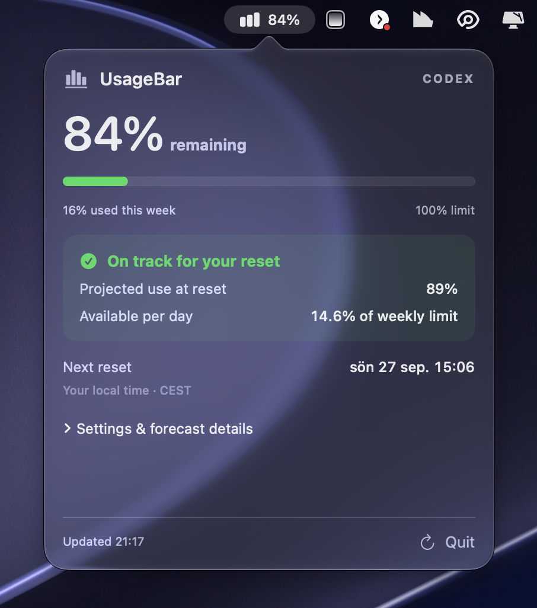

# UsageBar

**Know whether your Codex allowance will last the week—without leaving your menu bar.**

UsageBar is a small, native macOS app that shows your remaining Codex allowance, when it resets, and whether your current pace puts you at risk of running out.

**[Download for Mac — Apple Silicon](https://github.com/shoobah/UsageBar/releases/download/v1.0.0/UsageBar-1.0.0-AppleSilicon.dmg)** · [Latest release](https://github.com/shoobah/UsageBar/releases/latest) · [Report an issue](https://github.com/shoobah/UsageBar/issues)

<p align="center">
  
</p>

## Your allowance, at a glance

- **Always visible.** See the percentage of your weekly allowance remaining right in the menu bar.
- **Live updates.** Refreshes every minute, after your Mac wakes, or whenever you click Refresh.
- **A useful forecast.** See projected usage at reset and how much of your weekly allowance you can spend per day.
- **Warnings you can spot.** The menu bar icon turns amber when your projected usage approaches the limit and red when your pace is too high.
- **Optional notifications.** Get a macOS notification when you risk running out, with a six-hour cooldown to avoid repeated alerts.
- **Made for the Mac.** Native SwiftUI and AppKit, a compact scrolling popover, automatic icon contrast when you're on track, and optional launch at login.

## Get started

### Requirements

- An **Apple Silicon Mac** (M1 or later) running **macOS 13 or newer**.
- The **Codex CLI**, signed in with your own ChatGPT account.
- Internet access to refresh your allowance.

UsageBar looks for the CLI at `/opt/homebrew/bin/codex`, `/usr/local/bin/codex`, or `~/.local/bin/codex`.

### Install

1. [Download the DMG](https://github.com/shoobah/UsageBar/releases/download/v1.0.0/UsageBar-1.0.0-AppleSilicon.dmg).
2. Open it and drag **UsageBar** into **Applications**.
3. Eject the disk image and open UsageBar from Applications.
4. Click the percentage in your menu bar to see your usage and forecast.
5. Expand **Settings & forecast details** to enable notifications or **Launch at login**.

> **First launch:** This release is locally signed, but it is not Apple-notarized. macOS may block it when downloaded. Only approve opening the app if you trust the source.

There is no separate UsageBar account. It uses the existing Codex CLI sign-in on your Mac. If a colleague installs it, they see **their own usage**, not yours.

## What the numbers mean

The percentage in the menu bar is your weekly allowance **remaining**, not the amount you've used. For example, **85%** means you have used 15% of the weekly allowance.

| Indicator | Meaning |
| --- | --- |
| Normal icon | Projected usage is below 90%, or there isn't enough data for a forecast yet. |
| Amber warning | At least one forecast projects **90% or more** usage by reset. |
| Red warning | At least one forecast projects **100% or more**, or the allowance is exhausted. |
| Question mark | A fresh reading isn't available. Open the popover for details. |

The popover shows your reset time in your Mac's local time zone. If Codex reports another allowance window, that appears separately.

### How the forecast works

**Projected use at reset** extends your average consumption since the weekly window began. It appears after the first hour of the window.

**At your recent pace** uses locally observed consumption over a period of 6–24 hours. It appears after at least six hours of observations and a change of at least three percentage points, since usage readings are rounded. The warning uses whichever forecast is higher.

**Available per day** divides your remaining allowance by the time until reset. A value of 14.7% means 14.7 percentage points of the **total weekly allowance** per day.

These are estimates, not guarantees. A busy workday, a quiet weekend, a different model, or usage on another device can change the outcome. UsageBar measures **Codex allowance**, not every separate ChatGPT model limit.

## Privacy

- The download contains **no credentials, account details, or usage history**.
- UsageBar uses your existing Codex sign-in through the CLI; it does not read or copy access tokens directly.
- It requests account usage metadata. It does not start AI conversations, generate responses, or redeem credits.
- UsageBar adds no analytics or telemetry.
- Timestamped usage percentages and reset times stay on your Mac in `~/Library/Application Support/UsageBar/history.json`.
- History is limited to the current reset window and the last two days. A decrease in reported usage clears recent history. Preferences are stored in macOS UserDefaults.

Each refresh starts a short-lived local Codex helper over standard input/output and stops it afterwards. UsageBar opens no listening port or development server.

## Troubleshooting

**“Codex CLI was not found”**

Make sure the Codex CLI is installed at one of the supported paths listed above. Having only the ChatGPT desktop app installed is not enough.

**Usage won't refresh**

Check your internet connection and Codex CLI sign-in, then click Refresh. The app keeps the last successful reading and marks it as unavailable rather than replacing it with a guessed value.

**“No weekly limit reported”**

Codex hasn't returned a seven-day allowance for the current account. UsageBar doesn't invent one.

**No recent-pace forecast yet**

Leave the app running as you work. It needs at least six hours of observations and a three-point usage change. The average-since-reset forecast can appear sooner.

**Notifications aren't showing**

Enable them in UsageBar and check macOS notification settings. Alerts are sent when the pace warning is red, with at least six hours between alerts.

**Removing the app**

Disable Launch at login, quit UsageBar, and move it from Applications to Trash. Its local history and preferences remain on your Mac unless you remove them separately.

## Build from source

Requires Apple's Swift command-line tools on an Apple Silicon Mac. No third-party packages are needed.

```sh
git clone https://github.com/shoobah/UsageBar.git
cd UsageBar
./build.sh
open UsageBar.app
```

The build runs forecast and decoding checks with assertions enabled, compiles an optimized app, and signs it locally. Build products are excluded from version control.

Run the checks independently:

```sh
./test.sh
```

Check the live connection without opening the menu bar app:

```sh
UsageBar.app/Contents/MacOS/UsageBar --probe
```

| File | Purpose |
| --- | --- |
| `Sources/UsageModel.swift` | Account usage client, allowance models, forecast calculations, and checks. |
| `Sources/main.swift` | Menu bar UI, refresh scheduling, local history, notifications, and settings. |
| `build.sh` | Builds and locally signs the app. |
| `test.sh` | Runs forecast and decoding checks without disabling assertions. |

Built against the documented [Codex app-server protocol](https://learn.chatgpt.com/docs/app-server), using `account/rateLimits/read`.

---

An independent project by [shoobah](https://github.com/shoobah). Not affiliated with or endorsed by OpenAI.
